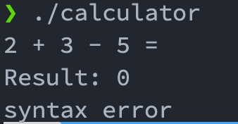

**Simple Arithmatic Calculator using bison and flex**

_commands_

`flex calc.l ` - Generates the lex.yy.c file
`bison -d calc.y ` - Generates calc.tab.c and calc.tab.h required for generating the calculator application
`gcc -o calculator calc.tab.c lex.yy.c -lm` generates the calculator app

_usage_

After running the above commands in order, a calculator application will be generated which we can run using the following command

`./calculator`

Enter your expression and get the output, ignore the syntax error if occurs

_example_

**Note**
Make sure to add '=' symbol at the end of the expression
